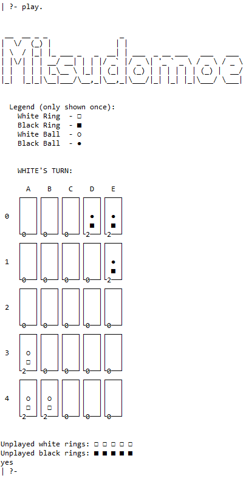
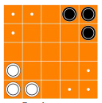
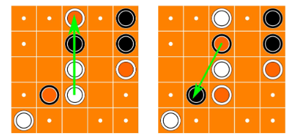
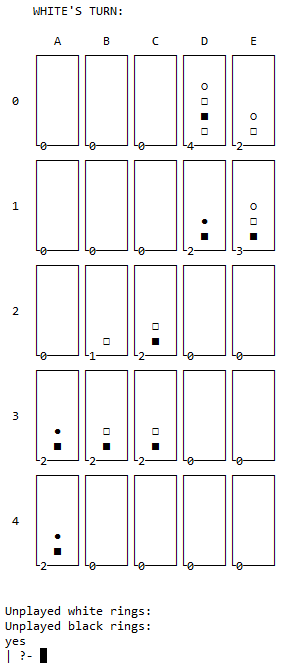
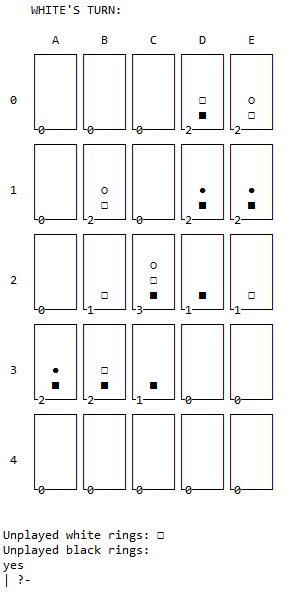
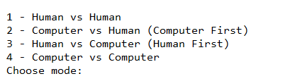
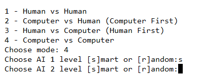
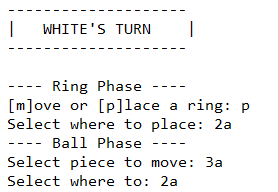

# Mitsudomoe
Projeto desenvolvido no âmbito da unidade curricular PLOG.



## Identificação

### Grupo Mitsudomoe_5
* Tiago Duarte da Silva - up201806516 - Turma 3
* Ricardo Jorge Cruz Fontão - up201806317 - Turma 3

## Instruções

Instalar e correr o SICStus prolog, caso esteja a ser usado o terminal dedicado em windows, aconselhamos a ir a `Settings > Font` e trocar para uma *font monospaced* (por exemplo Consolas).

Para correr o jogo em si, corra `(re)consult('game.pl')` e corra a função `play` sem argumentos.

## Regras de jogo

[Livro de Regras - Mitsudomoe](docs/MITSUDOMOE_EN.pdf)

### Objetivo

Chegar com as 3 bolas ao canto do jogador adversário.

### Equipamento

* Tabuleiro de 5x5
* 3 bolas para cada jogador
* 8 anéis para cada jogador

### Preparação

Cada jogador começa por colocar 3 anéis no seu canto e 1 bola em cima de cada anel conforme a imagem.



### Regras Gerais
* Quando um componente entra em jogo, não pode voltar a sair.
* Uma bola pode apenas ser colocada em cima de um anel da mesma cor.
* Adjacente pode ser ortogonalmente ou diagonalmente.
* Quando uma bola chega a um dos espaços finais não pode voltar a sair.

### Turno

Um turno consiste em dois passos:

1. Colocar no tabuleiro ou mexer um dos próprios anéis
2. Mexer uma das próprias bolas

Se não for possível uma jogada, o jogador perde automaticamente.
No caso de existirem 3 bolas **de qualquer cor** nos home spaces de um jogador no final do seu turno, ele perderá o jogo.

#### Mover um anel

Nesta fase podemos colocar um anel de fora do tabuleiro ou recolocar um que esteja já em jogo. Só podem ser movidos anéis que estejam expostos (não tenham qualquer bola ou anel por cima). O lugar onde se coloca o anel jogado pode ser qualquer um que não tenha uma bola em cima. Se tiver anéis nessa casa coloca-se por cima deles.

#### Mexer uma bola

A primeira possibilidade é mexer a nossa bola para uma casa adjacente que tenha um anel nosso exposto em cima.

A segunda opção é "passar" por cima, em linha reta, de quantas bolas adjacentes houver, tendo que aterrar num anel exposto do próprio jogador. De seguida o jogar tem de recolocar qualquer bola que passou por cima que pertença a um adversário para uma posição válida(anel da mesma cor). Se alguma das bolas não poder ser recolocada o salto não pode ser feito.



### Final de jogo

Se no fim do turno do jogador todas as suas bolas estiverem no canto oposto do início do jogo, esse jogador ganha.


## Representação interna do estado de jogo

A representação interna do jogo (GameState) consiste de uma lista de 4 elementos:

1. O primeiro elemento é uma lista de listas de *stacks* (listas) em que cada stack representa uma célula do jogo e armazena as peças lá colocadas preservando a sua ordem (ordem crescente de índice corresponde a ordem crescente de altura).
2. O segundo elemento é o número de anéis brancos que não estão em jogo.
3. O terceiro elemento é o número de anéis pretos que não estão em jogo.
4. O quarto elemento representa a quantidade de peças que são representadas de cada célula, de forma a que o jogo fique "legível".

Relativamente a cada peça usamos uma representação númerica diferente, por exemplo, um anel branco pode ser representado pelo número inteiro 1 e um anel preto pelo número inteiro 2. 

No caso de uma célula estar vazia a lista que a representa também é vazia.

Representações do estado inicial e de um possível estado intermédio e final:
```prolog
% 1 : White Ring
% 2 : Black Ring
% 3 : White Ball
% 4 : Black Ball

initial(GameState) :-
    GameState = [
        [  % Game board
            [ [],     [],     [],  [2, 4], [2, 4]],
            [ [],     [],     [],  [],     [2, 4]],
            [ [],     [],     [],  [],     []],
            [ [1, 3], [],     [],  [],     []],
            [ [1, 3], [1, 3], [],  [],     []]
        ],
        5, % Unplayed white rings
        5, % Unplayed black rings
        3  % Shown Stack Size
    ].

mid_game(GameState) :-
    GameState = [
        [  % Game board
            [ [],     [],     [],        [2, 1], [1, 3]],
            [ [],     [1, 3], [],        [2, 4], [2, 4]],
            [ [],     [1],    [2, 1, 3], [2],    [1]],
            [ [2, 4], [2, 1], [2],       [],     []],
            [ [],     [],     [],        [],     []]
        ],
        1, % Unplayed white rings
        0, % Unplayed black rings
        4  % Shown Stack Size
    ].

end_game(GameState) :-
    GameState = [
        [  % Game board
            [ [],     [],     [],     [1, 2, 1, 3], [1, 3]],
            [ [],     [],     [],     [2, 4],       [2, 1, 3]],
            [ [],     [1],    [2, 1], [],           []],
            [ [2, 4], [2, 1], [2, 1], [],           []],
            [ [2, 4], [],     [],     [],           []]
        ],
        0, % Unplayed white rings
        0, % Unplayed black rings
        5  % Shown Stack Size
    ].
```

A informação relativa a que jogador joga a seguir é guardada em **Player**:
* 0 -> Branco
* 1 -> Preto


## Visualização do estado de jogo

O predicado [`display_game\2`](display.pl) desenha no ecrã um tabuleiro de qualquer dimensão até 27x27. Para cada linha do tabuleiro é chamado o predicado `print_line\4`, que é divido em top, mid e bot, desenha as linhas necessárias na consola. Cada célula pode ser identificada por um par número e letra, inspirado pelo sistema do xadrez.


No canto inferior esquerdo de cada célula é ainda mostrado o número total de peças na *stack* respetiva. Este número pode ser alterado ao longo do jogo e define ainda o tamanho de  cada célula (em altura e largura) para o tabuleiro ser sempre de visualização fácil. A largura de cada célula é sempre um número ímpar para garantir que o espaçamento entre os vários elementos é correto.


O predicado `print_line_mid\4` é responsável por desenhar as N peças no topo da *stack*, mas sempre encostadas à base da *frame* da célula. Para este efeito, o predicado `get_stuffed_elem_from_end0\s` dá-nos qual o código da peça numa dada posição da *stack*, mas como que se estivesse *stuffed* (por exemplo: [1, 2] seria interpretado como [1, 2, 0] para a visualização permanecer correta, mas sem nunca alterar a lista).

## Screenshots

### Estado de jogo inicial


### Estado de jogo intermédio


### Estado de jogo final



## Lógica de jogo

### Representação do estado de jogo

Pode ser encontrado [aqui](#representação-interna-do-estado-de-jogo).

### Visualização de estado do jogo

A visualização do jogo é feita da mesma forma do relatório intercalar como pode ser visto [aqui](#visualização-do-estado-de-jogo), com a exceção de as células estarem um poucos mais esticadas horizontalmente, depois do feedback do docente.

Relativamente aos menus introduzidos para a seleção de jogadas, dos níveis da AI e para a seleção do modo de jogo, estes podem ser encontrados no ficheiro [input.pl](input.pl).

Para a leitura do modo de jogo usamos o predicado [read_mode/1](input.pl), que mostra a mensagem com as opções possíveis e depois lê a opção do utilizador.



Para a leitura da dificuldade da AI, se for necessário em função do modo de jogo, lemos a dificuldade (random ou smart) para a AI se o modo for *Humano vs AI* ou duas vezes se o modo for *AI vs AI*.



Para a leitura de cada jogada e de acordo com a estrutura de cada jogada, começamos por perguntar ao utilizador se quer por um anel novo em campo ou  mover um que ja esteja em campo, sempre perguntando as coordenadas. De seguida as coordenadas da bola que quer mover e as coordenadas de destino.

Toda a introdução de coordenadas pode ser feita na forma de "A3" ou "3A", ou seja, coluna e linha ou vice-versa, com as letras maiúsculas ou minúsculas. Os inputs também não necessitam de um ponto final no fim.



### Estruturação de um *move*

De forma a representar cada **move** nós usamos uma lista de listas:

As coordenadas são sempre representadas em [Row, Col] e um displace é [Coordenadas Iniciais, Coordenadas Finais].

**Move -> [DisplaceRing, DisplaceBall, [Displaces], Player]**

**DisplaceRing** -> Displace do anel a mexer (Coordenadas iniciais são [-1,-1] se a jogada for colocar um anel novo em jogo)

**DisplaceBall** -> Displace da bola a mexer

**[Displaces]** -> Displaces às bolas inimigas no caso de ocorrer um vault (vazia se não houver ou não ocorrer um vault)

**Player** -> Jogador que realiza a jogada (white/black)

### Lista de jogadas válidas


### Execução de jogadas

O nosso predicado **move/3** está divido em 3 partes.

Numa primeira parte fazemos uma chamada ao predicado **new_move/5** que decompõe um *move* nas suas partes (DisplaceRing, DisplaceBall, Displaces, Player).

De seguida, temos a fase de movimento do anel em que usamos o predicado **move_ring_phase/4**. Este predicado por sua vez chama o predicado **place_new_ring/4** ou **move_ring/4** dependendo se queremos mexer um anel já em jogo ou colocar um novo.

Por fim usamos o predicado **move_ball_phase/5** que move tanto a bola especificada no move como os possíveis Displaces gerados por algum vault.
Este predicado funciona usando os predicados **move_ball/5** que move uma bola e retorna os Displaces se for um vault e **relocate_balls/5** para tratar de qualquer bolas que possam ter de ser realocadas por causa de um vault.

### Final de jogo

Para verificarmos o final de jogo usamos o predicado **game_over/3**.

A primeira condição verificada é se as casas do inimigo ficaram ocupadas todas com bolas com recurso ao predicado **check_enemy_cells/2**. Neste caso o jogador que executou a jogada ganha.

De seguida, verificamos as casas iniciais do jogador que executou a jogada. Esta verificação é feita para prevenir jogo passivo.

Por fim, verificamos se o oponente ficou sem jogadas (por exemplo se não tiver mais rings para colocar em jogo e nenhum dos seus está exposto). Para verificar este caso fazemos uma chamada a **valid_moves** para o oponente e verificamos se o seu output é vazio. Se for quer dizer que o autor da jogada vence.

Se nenhum dos casos anteriores se verificar o predicado da return a *Winner* como none.

A seguir ao predicado **game_loop/3** usamos o predicado **handle_winner/5** que baseado no vencedor mostra a mensagem de vitória ou se este não existir faz a chamada "recursiva" do predicado **game_loop/4**.

### Avaliação do tabuleiro

Para que a AI desenvolvida possa escolher o melhor *move* num certo momento nós usamos o predicado **value/4**. Este predicado retorna o valor para o *GameState*.

Em primeiro, nós verificamos se temos 3 bolas nas nossas posições iniciais. Neste caso quer dizer que a AI se iria "suicidar", logo damos a esta jogada um valor muito alto(valor mau).

De seguida, verificamos se as casas do inimigo contém 3 bolas. Se isto acontecer quer dizer que estamos perante uma jogada vencedora, logo damos-lhe um valor negativo de valor absoluto muito alto de forma a que esta jogada seja escolhida de certeza.

Se nenhuma das condições anteriores se aplicar passamos à verificação normal das jogadas.

Para nós o valor de um tabuleiro consiste em calcular a soma das médias da distância de cada bola a cada célula do oponente(objetivo). 

Valor do Tabuleiro = Média(dist(B1, C1), dist(B1, C2), dist(B1,C3)) +
                     Média(dist(B2, C1), dist(B2, C2), dist(B2,C3)) +
                     Média(dist(B3, C1), dist(B3, C2), dist(B3,C3))

**B** -> Bola

**C** -> Casa final do oponente 

### Jogada do computador

A AI implementada tem duas dificuldades: **smart** e **random**.

Na dificuldade **random** o predicado **choose_move/4** usa o predicado **valid_move/3** e depois apenas escolha um membro aleatório do seu retorno *ListOfMoves*. Fazemos esta escolha até que saia uma jogada que não nos perca o jogo, uma ocorrência comum no início do jogo. 

Na dificuldade **smart** o predicado **choose_move/4** usa o predicado **valid_move/3** para gerar *ListOfMoves* com todos os moves possíveis. De seguida usamos um predicado criado por nós chamado **min_map/3** que retorna o elemento de uma lista para o qual o valor de um predicado é mínimo. Desta forma criámos um predicado auxiliar que nos desse o valor de um *move*. Desta forma escolhemos sempre o move com o valor mais baixo.

Para determinar o valor de um *move* fazemos uso do predicado **value/4**. No entanto, em vez de apenas calcularmos o valor do *GameState* após um *move* para nós, também calculamos qual o seu valor para o inimigo de forma a tentar maximizar o valor para nós sem ajudar em muito o adversário. A fórmula usada é a seguinte:

Valor de um Move = Valor para o Jogador + Valor para o Oponente * 0.5

De forma a que a AI não fique determinista e se torne um pouco mais interessante a este valor ainda adicionamos um valor aleatório, ou seja, a fórmula passa a ser:

Valor de um Move = Valor para o Jogador + Valor para o Oponente * 0.5 + random(-0.5, 0.5)

Após procurar em *ListOfMoves* pela jogada com o valor mais baixo este valor é retornado para ser usado no jogo.

### Loop de Jogo

O nosso loop de jogo encontra-se num predicado chamado **actual_game_state/4** que contém os seguinte passos:

1. Mostrar o estado atual do jogo no ecrã.
2. Chamada de **repeat** de forma a que se o jogador der input a uma jogada inválida, possamos voltar a pedir esta jogada.
3. Chamada a **pick_move** para a escolha de jogada. Se for a AI a jogar a jogada é pedida a **choose_move** e se for um humana a jogada é pedida a **read_move**, ou seja, é pedida no terminal do Sicstus.
4. Depois é efetuada essa jogada para verificar se é possível e cria-se o *GameState* seguinte.
5. Depois verificamos se a jogada efetuada acaba o jogo com recurso a **game_over**  e a **handle_winner**.
6. Caso não haja vencedor, **handle_winner** irá chamar o predicado **game_loop** que apenas tem como objetivo alternar quem é a jogar se for AI vs Humano ou trocar os níveis de dificuldade se for AI vs AI, de forma a usar a dificuldade e modo certo em **actual_game_loop**.

## Conclusões

O objetivo deste trabalho era desenvolver na linguagem Sicstus Prolog um jogo de tabuleiro incluindo representação gráfica, uma AI simples e uma aleatória e suporte para modos de jogo como por exemplo AI vs Humano ou AI vs AI. Todos os objetivos foram concluídos com sucesso. 

Relativamente a *known issues* pode referir-se que a fórmula de valorização de *GameStates* podia ser melhorada possivelmente para incluir diferentes estratégias, por exemplo, defender as próprias casas ou até bloquear rings do oponente. Outra issue é: se na leitura de coordenadas inserirmos mais carateres do que é suposto ele nas leituras seguintes irá imprimir o *prompt* várias vezes mas sempre aceitando o input inicial se este for o desejado.

Por fim, melhorias possíveis para o futuro seria a implementação de uma AI que calculasse o valor das suas jogadas com vários níveis de profundidade, ou seja, ver até mais do que uma jogada no futuro. Outra possibilidade seria a hipótese de alterar a quantidade de elementos mostrados por stack no terminal, visto que isto é suportado no código. Por fim poderíamos usar tabuleiros maiores do que 5x5 apesar destes não serem referidos nas intruções do jogo, visto que são possíveis de usar na nossa implementação.

No geral, este trabalho contribui significativamente para o nosso entendimento da linguagem Prolog.

## Bibliografia

- [Livro de Regras - Mitsudomoe](docs/MITSUDOMOE_EN.pdf)
- [Documentação ofical do SICStus](https://sicstus.sics.se/documentation.html)
